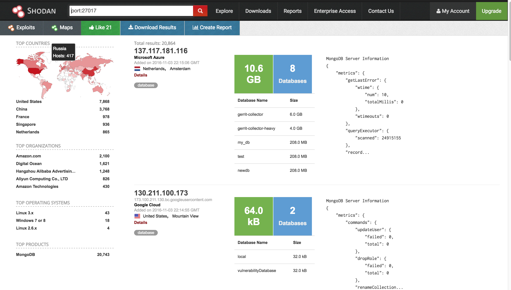
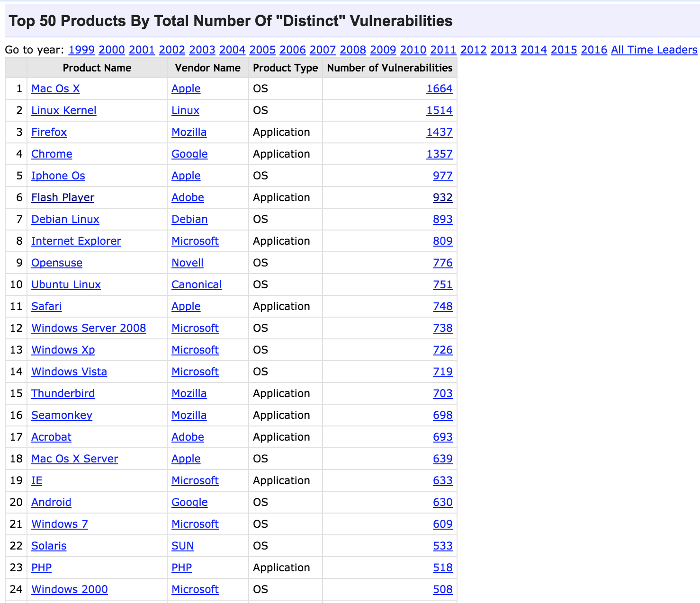
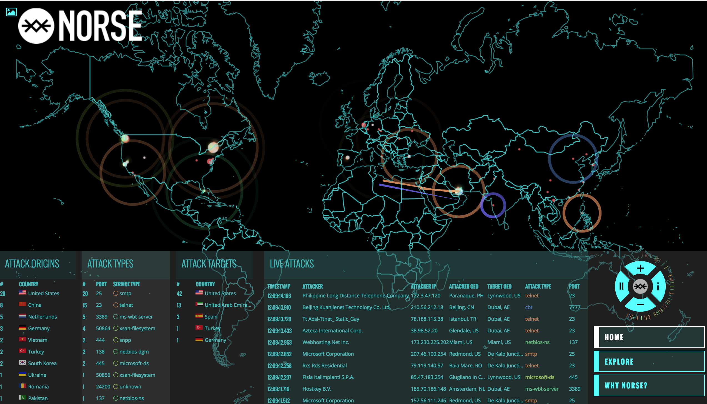

A recently released information about an old data beach of more than 500 million Yahoo users has put question mark on the multi-billion dollars sale of Yahoo to Verizon. After all, no-one wants to acquire a liability and not account for all future costs involved. Online dating app for spouse cheaters, Ashley Madison had to shutdown after a breach exposed its user information and billing related info leading to many real life divorces, resignations and [suicides including that of a pastor](http://money.cnn.com/2015/09/08/technology/ashley-madison-suicide/index.html). 600,000 Facebook accounts were hacked daily in 2011, maybe more today. The massive SONY pictures hack led to exposure of a lot of sensitive information regarding its projects, personal details of key executives and Hollywood bitching. It also exposed social security numbers and passwords of its employees and around 1 million users, allegedly all stored in a simple excel file clearly marked as 'Passwords.xls'. The famous fappening saga exposed nude pictures of a lot of Hollywood celebrities happened when a hacker wrote a [script to test celebrity Apple accounts for the top 500 most popular passwords that were approved by Apple's password policy](https://medium.com/@ryandemattia/what-we-should-learn-from-the-fappening-a-lesson-in-security-design-96e49f7eaee9#.nfm9z8637) (Caps, special chars and all). Much recently, an attack on a key DNS service provider Dyn brought down almost half of United State's internet and major websites like The New York Times, Twitter, etc.

Where do things go wrong? Most of the exploits are human errors that lead to an opportunity and was attacked upon by a malicious hacker. Let us go back to the the typical flow of an App and interaction pattern of the App and its users. A user sitting in a cafe is browsing Product Hunt and comes across a new dating app, that promises to provide meaningful relationships. You install the app, signup using one of the two passwords you use everywhere on the web and if you are a developer you might wonder why there is no padlock like indicator for mobile apps to ensure that the communication between you and the dating app's server is secure and cannot be snooped upon. You start using the app, carefully swiping and writing witty messages you learnt on a reddit megathread but all the girls seem to be offline. Suddenly you get a premium subscription offer that will show you more frequently to girls than other straight males. You quickly add your credit card for the $5 subscription and then close the app. The dating app, as with all dating apps with above average UX, gets a lot of users quickly, and a lot of press for their focus on meaningful relationships and then a ton of money from prominent people in the valley for changing the world. We shall not focus on these issues, we just want to know where things can go wrong.

Remember you were sitting in a coffee shop. What if in a hurry to release their app, the developers are taking signup information on a non-secure channel? This means anyone sitting in the cafe can listen to and intercept your password, which you share across half the services on the internet. This rarely happens today. Let us move to another scenario. What if the wi-fi you connected to with the name Cafe_Noir is not the Cafe's wifi but a fake one to intercept your communications. Remember that your Mobile phone or laptop saves wifi network and their passwords so that when you revisit a cafe, it automatically logs in without you having to enter the password again. [With a small cheap setup, anyone can get started stealing data at public WiFi hotspots.](https://go.authentic8.com/blog/stealing-data-over-wifi-is-easier-than-you-think). Are you surprised that your phone and laptop blabbers about every wifi network you connected to everyone around? You will learn more about Transport Layer Security and its application to to Web and other platforms and protocols in Chapter 2.

Let us assume nothing exciting happened in transit and you were talking on a secure channel with the app's servers. Sensitive information like passwords are not stored as it is in databases but are hashed and stored. A hash is a garbled representation of your password with almost no way to retrieve your original password from the hash itself. When you try signing in later, the value you type in the password box in the app is hashed and checked against the hash of your password stored in the database. If both matches, you are logged in. This process, known as hashing ensures that even if the database is leaked, it would prove tough to get your password from the hash. 

[[INSERT hash example pic]]

Other information like your email, addresses, location history, messages exchanged are stored in plain text. The piece of code used to compute the hash for passwords is crucial. Any mistake made in designing or implementing the code would be disastrous. Therefore, companies generally go with a proven hashing mechanism and a corresponding fully baked implementation that has been around for some time and has gone through some code reviews. An important consideration for hashing mechanisms is that the function must be slow to run on computers. This is counter-intuitive as nobody wants their code to be slow. But this is done to ensure a hacker cannot just run this code on say all 3 to 8 character strings made from all possible combinations of alphabets, numbers and special characters and then just check the database they hacked for the corresponding hash entries in the table they just created. These kind of table are called rainbow tables. Even with slower hash functions, one may apply additional computing power to work and create this rainbow table. To prevent rainbow tables from working effectively on cracking hashed passwords we generate a small random string and append it to the users password and then generate and save the hash for it. The salt is stored in plain text alongside the hash. Now the attacker has to generate different rainbow tables for each and every password taking into account the salt for the respective hash making the computation mostly in-feasible.  Another characteristic of these hashing mechanisms is that it should avoid generating exactly similar hash for two different passwords or strings (called a hash collision). It should be difficult for someone to just come up with two different strings that will generate the same hash. Note the use of words avoid and difficult, collisions will exist but someone should not purposefully make it happen. This condition proved to be an issue when [researchers were able to generate two different certificates with the same hash using MD5 hashing mechanism thus effectively breaking SSL](http://www.zdnet.com/article/ssl-broken-hackers-create-rogue-ca-certificate-using-md5-collisions/). MD5 was phased out as a hashing mechanism for SSL from all major browsers till 2013 and even a stronger version SHA1 is in process of being phased out till 2017 due to fear of collision.   You will learn the details of hashing and various hashing methods in Chapter 7. If there is a single thing that you need to take remember from this document, it is never to store passwords in plaintext. Just use bcrypt.

But how do the hackers get the data dump in the first place? Most of the times it is fairly easy. [In case of the SONY pictures hack, the hacker group LulzSec is said to have exploited a SQL injection vulnerability](https://go.authentic8.com/blog/stealing-data-over-wifi-is-easier-than-you-think). SQL is a programming language used to fetch and modify data from databases. A major weakness of SQL is the inability to differentiate between code and data. SQL statements when used in programming languages and accepting data inputs directly from users can be manipulated by hackers by supplying code instead of data and getting extra information from the databases. You will learn more about SQL injection, how to prevent them and how to check for it in Chapter 6.

[[Sample of SQL and SQL injection]]

Another common way that hackers get these dumps is by simply connecting on the database machines belong to the companies that have either no passwords and are exposed publicly on the internet or have common or weak passwords. Shodan, a search engine for open ports over the whole internet provides an easy way to search for open databases like MongoDb, MySQL and even the db sizes. Taking a dump of these databases is a matter of minutes to hours depending on the quantity of data. We will learn about various configuration mistakes in Chapter 12.

Two important questions arise -

1. Why use passwords? The general crowd is extremely bad at selecting strong passwords and tend to reuse the same password across all different internet services. Why do we even need a password to prove that we really are who we claim to be. Is there any other safer way to do this? We evaluate this in Chapter 8 and a password-less way of authentication and much more in Chapter 9.
2. Why store all information on a remote server which has no way to prove to us that our information is being stored securely or heck our password is being hashed at all and is not in plaintext like SONY. is there a way we can store our information with us and deploy our own measures to secure them, depending on how likely we are to be attacked and are free to take our data offline or delete it whenever we want.

Now that the hackers have your password or the hash of your password, it is trivial to login to your account and all other accounts that share the same password. To prevent this, most of the companies have resorted to something called 2 factor authentication. You might have used this in Gmail, Twitter or Facebook login where after you correctly enter your password, you get a security PIN code as a text message on your designated mobile phone. In case of Gmail, you can even use the Google Authentication app which gives you a code to be entered while login. Having the mobile phone or the configured Google Authenticator app adds an extra layer of security that you are who you claim to be. You will learn about authentication and 2 Factor authentication methods in detail in Chapter 4.

You should be aware that 2 Factor authentication using SMS as the second factor is no longer considered secure. It is possible to fool your mobile phone into connecting to a hackers homemade device which acts like a local mobile tower ([more commonly known by the name Stingray](http://resources.infosecinstitute.com/stingray-technology-government-tracks-cellular-devices/)) and then intercept all communications. It is also possible (however difficult) to exploit a vulnerability in the telephonic signalling protocol SS7 to route calls and SMS meant for your phone to a malicious hackers phone.  In some countries, it is fairly easy to call up your telecom provider and request changing of SIM and gain access to your 2 factor SMS codes [as happened with an activist whose Twitter account was hacked despite 2 factor authentication being active](https://www.wired.com/2016/06/deray-twitter-hack-2-factor-isnt-enough/). Infact, [the National Institute of Standards and Technology of the US has deprecated SMS as a medium for 2 factor authentication in August 2016.](https://techcrunch.com/2016/07/25/nist-declares-the-age-of-sms-based-2-factor-authentication-over/) We will examine other methods of secure 2 factor authentication in Chapter 4.

An important part of data leaks is financial data leak. The darknet (a network over internet that is specifically accessed with configured software such as Tor) is full of shady entities selling complete credit card information by bulk. Most of these were part of some data leak or other. A data leak involving card information will impact the entities users severely, sometime months after the leak was disclosed and fixed. 

When you use a third party service like Google Analytics or login via Facebook on your website or app, you get a set of tokens that uniquely identifies and authenticates your app to their systems. These tokens also called API keys are to be used in your code. Sometimes, you might inadvertently expose these tokens publicly for example when pushing your code to a public repository on GitHub. These API keys can then be misused to get data, disrupt your systems or sometimes even wipe down your cloud deployments (e.g. Amazon Web Services API full access keys). In fact, GitHub is full of numerous exposed API keys for nearly all popular API providers.

An important vulnerability for serious stuff like device takeover or stealing remote information is Remote Code Execution or the ability to run an arbitrary piece of code on the target's device, be it a laptop, mobile phone or a [nuclear power plant (e.g. Stuxnet is a sophisticated malware designed to sabotage nuclear facilities)](https://www.wired.com/2014/11/countdown-to-zero-day-stuxnet/). If you go through Apple iOS and macOS security update logs, you will get instances of RCE fixes in almost every other update,  [like for example taking over an Apple device via a simple text message or email](https://www.theguardian.com/technology/2016/jul/22/stagefright-flaw-ios-iphone-imessage-apple). And, [there might be an equivalent bug for Android so that Apple haters are not left out on getting hacked.](https://www.theguardian.com/technology/2015/jul/28/stagefright-android-vulnerability-heartbleed-mobile). There have been a significantly large number of vulnerabilties in Adobe Flash which could be exploited to run a hackers code, one of the reasons for its deprecation from major web browsers.

**Human Factor in Security**
An important but mostly overlooked aspect of security design and flaws is social engineering attacks. Human interaction is an important aspect of software and is often misused in various non-technical ways to gain illegal access to systems. For example, the hacker who called Verizon to get a new SIM to hack the activist's account probably did not write a single line of code to break 2 factor authentication. A huge population around the world, mainly in developing countries are having their first internet experience right now. Without the right set of information, it would be fairly easy to engineer an attack that would appear legitimate to them and then convince them in exposing their personal information, passwords and payment details. For example a link like https://google.com/amp/gmail-login.website will redirect to gmail-login.website which can be a valid hackers website with Gmail like login page thanks to new TLDs or domain extensions like .website coming up. This is happening at an alarming rate right now. If the dating app in our earlier example has not set their DNS settings for email properly (specifically SPF header, DMARC and DKIM), it would be fairly easy to send a mail appearing to come from their domain and email address and then exploit their users into revealing personal data. DNS settings are explained in detail in Chapter 12. 

A common way to exploit users is to place clickbaity advertisements on porn websites inviting a click which then either asks for personal information and payment details or leads to a malware install. A malware is a small piece of executable that is mostly controlled remotely and performs certain set of instructions like deleting files on the users system, stealing user passwords or can be used to attack other websites and systems in tandem with other malwares installed on various other systems, collectively called as a botnet.

Every system on the internet be it a website or a mobile app like Pokemon Go is capable of handling a certain amount of traffic. When the system is bombarded with a traffic that is much larger than it is designed to handled it collapses, leaving its users with no service. This is commonly known as Denial of Service or DoS attacks. When the traffic generated to bring down systems is coming from not a single system but various sources, it is said to be a distributed DoS. DDoS attacks are generally done via botnets or a network of compromised systems. Recently, a DDoS attack on a DNS service provider brought down almost half of US internet including popular websites like Twitter, Netflix, Reddit, The New York Times, The Guardian and more. [Prelim reports suggest that this was a work of amateur hackers using a popular botnet called Mirai](https://techcrunch.com/2016/10/26/dyn-dns-ddos-likely-the-work-of-script-kiddies-says-flashpoint/). 

Note that the compromised systems need not be computers or mobile phones. It can be any internet connected device which has some processing power and ability to execute code. With devices such as baby monitors, digital cameras connected to internet and most of them with default passwords or weak passwords, it has become fairly easy to create botnets using these devices. Mirai is such a botnet that feeds on insecure IoT devices and [whose code was recently released on GitHub](https://github.com/jgamblin/Mirai-Source-Code) by an anonymous hacker. [Reports suggest Mirai bots have more than doubled since the release of its source code in public](https://threatpost.com/mirai-bots-more-than-double-since-source-code-release/121368/). [Insecam is a directory of  insecure internet enabled cameras](https://www.insecam.org/) that gives you live feeds from around the world.

DDoS attacks are generally measured in terms of bandwidth of traffic. The recent attack on Dyn, a DNS service provider for major internet services was mesured to be of 1.2Tbps, almost twice the size of the largest DDoS attack of all time, which too happened in 2016.

 

You can read more about DoS attacks in Chapter 13.

In 2005, MySpace (when it still was a thing) was hit by a relatively harmless vulnerability where more than a million users profiles displayed the text 'but most of all, samy is my hero'. And all this happened within a day of its release by 21 year old Samy Kamkar. MySpace has to be shut down for sometime to fix the issue and Samy was raided by the FBI and put on probation with no computer access for three years. This was an example of Cross-Site Srcipting bug, more commonly known as XSS. XSS is one of the most frequently occuring vulnerabilites in web security. XSS allows execution of arbitrary JavaScript code in a users browser when the user visits a vulnerable website. The code can load other remote JavaScript files, steal cookies and session information, deface websites, deceive users into disclosing their secrets appearing as the legitimate website or display some text as in case of MySpace and Samy. XSS is discussed in Chapter 6 and some ways to mitigate them by using modern headers inbuilt in recent HTTP specification are discussed in Chapter 11.

A group of people are of the opinion that [improper input handling is the root cause of almost all security issues](http://www.langsec.org). A programming language or even a general language has usually a defined grammar which aids in giving meaning and structure to content generated in the language. In case of programming languages, a parser is used to process the content and extract something useful with it. Since the parsers are itself pieces of code implemented in some programming language, it can contain issues that might lead to a security vulnerability. Since parsers are pieces of code, a given grammar can be implemented in various different systems by different people leading to an interesting variety of errors. Hand-coding parsers can only make the issue worse. Nginx and Apache are two of the most commonly used open source Web servers in use around the world. In 2013, a bug was discovered in the nginx parser for HTTP headers written in C programming language, [the exactly same bug was discovered and fixed in Apache 11 years back](http://langsec.org/papers/the-bugs-we-have-to-kill.pdf). Another issue in parsing the Name (specifically Common Name) of server in HTTPS certificates could lead [to issuing certificate for a legitimate site to an evil entity](http://langsec.org/papers/Sassaman.pdf).You will learn more about HTTPS in the next chapter and we will examine all input/output related issues in Chapter 6.

Security does not have to make things difficult for end users. If your fancy two factor authentication is cumbersome, it would decrease adoption amongst your users, making your security measures useless. Another common mistake is to not communicate security measures and actions effectively to your users. We discuss UX design issues and tradeoffs for security in Chapter 17.

Before you get started with looking under the hood of systems, you need to be aware of the legal implications. In some countries, something as simple as logging into a open computer belonging to a organization can land you in jail for several years, even if you did it with the right intentions. Most of the larger companies and startups have a bug bounty program for reporting security related issues, where you can report any vulnerability found in the companies systems and can get rewarded for them if the bugs are within the scope of the program. If you are itching to look under the hood, the best way to start would be to find companies with public bug bounty programs and get started with them.

Unless you are an academic researcher, you would almost never get to design cryptography protocols and systems or even implemnent a large enough parser and that is a good thing. Designing and implementing anything new is prone to be buggy and vulnerable till a lot of revisions are done to it. However, you should be aware of the choices available to you and make a informed choice evaluating all the tradeoffs. This guide will help you make better security related decisions. You would be able to avoid pitfalls such as security by obscurity. You would appreciate the need for stronger hash functions and maybe even have a desire to look under the hood whenever you are using a system online, while knowing the repercussions. As you progress through this guide, our aim is to start from nothing and make you understand the most common attack scenarios and ways you as a developer can avoid them. You will be able to avoid common pitfalls while you write code or configure your systems. There might be a percentage of readers who might find this guide slow, please feel free to skip some portions of the guide and mail any feedback to guide@fallible.co

